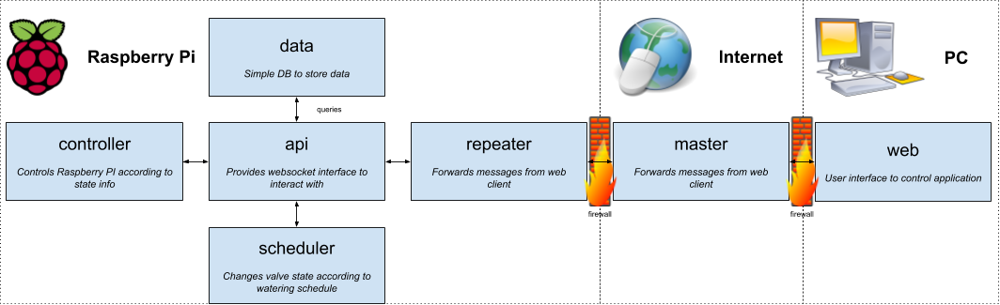

# orchardbot-app

[](https://circleci.com/gh/jpnauta/orchardbot-app)
[](https://codecov.io/gh/jpnauta/orchardbot-app)

*Main application for Orchardbot, the robot who can turn on a tap*

## Design

*Yes, I know, this bot is hilariously over-engineered and excessive, 
but hey, we had some fun 😅*



This bot is designed with micro-services communicating over websockets.
- The API validates changes and proxies them to any socket clients listening
- The scheduler watches the appropriate crons and triggers changes accordingly
- The controller listens for changes and updates the actual embedded system's I/O ports


## Basic Usage

The easiest way to run this project is using `docker-compose`.

```
docker-compose build
docker-compose up
```

## Local Usage

To install this project locally, use `npm` to install and build the project

```
npm install
npm run build
```

Then run the app you wish to start

```
npm run start:api  # OR
npm run start:controller  # etc.
```

## Production Usage

To use in production, you will need Raspberry Pi 3 with [Raspbian][raspbian] installed. You can follow
[Raspberry Pi's documentation][raspberry-pi-install] to do this.

After Raspbian is installed and running, you will need to install [Docker][docker] on your Pi.

```
curl -sSL https://get.docker.com | sh
sudo apt-get install -y docker-ce docker-compose
```

You will also need to add the current user to the `docker` group.

```
sudo usermod -aG docker pi
```

This will eventually require you to reboot your Pi.

Next, clone the project repo into your `Desktop` folder.

```
cd ~/Desktop/
git clone https://github.com/jpnauta/orchardbot-app.git
cd orchardbot-app/
```

Add the deploy script to your `~/.bashrc` file.

```
echo 'bash ~/Desktop/orchardbot-app/deploy.sh` >> ~/.bashrc
```

Finally, reboot your Raspberry Pi.

```
sudo reboot
```

The first boot up will take several minutes. 

If nothing works, you can debug the startup script manually.

```
bash deploy.sh
```


[raspbian]: https://www.raspberrypi.org/downloads/raspbian/
[raspberry-pi-install]: https://www.raspberrypi.org/documentation/installation/installing-images/
[docker]: https://www.docker.com/


